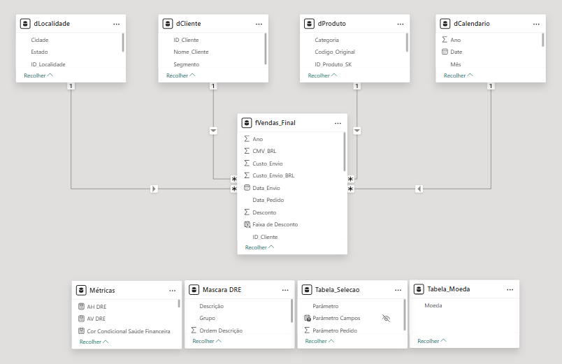
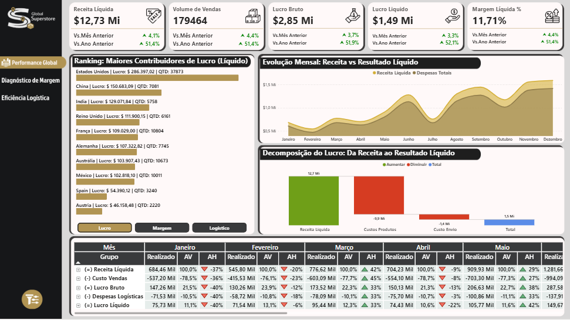
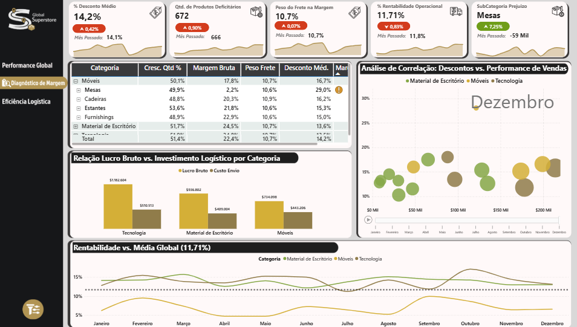
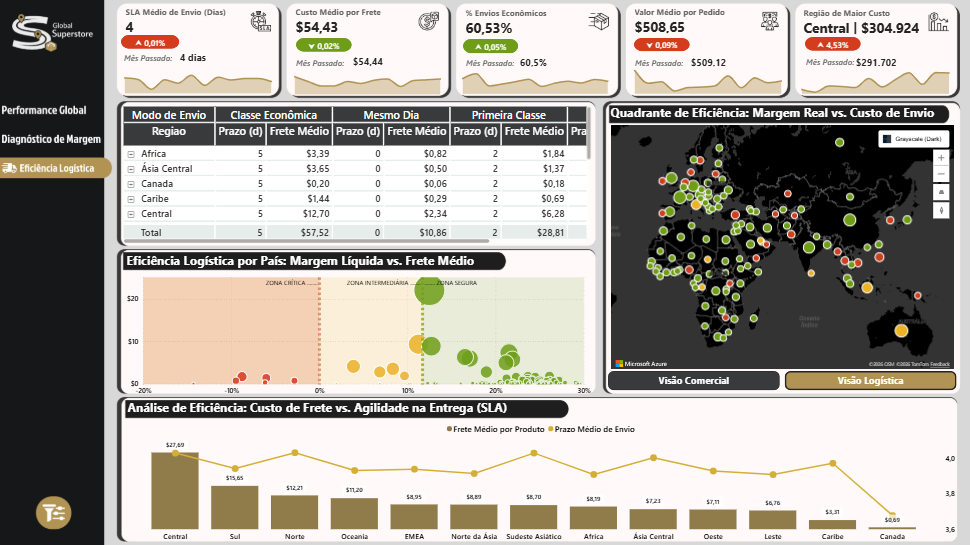

# Superstore Global: Otimização Logística e Rentabilidade

Projeto BI End-to-End — da extração automatizada em Python com conversão de moeda via API em tempo real, até a modelagem dimensional em nuvem (Aiven MySQL) e visualização estratégica em Power BI com três camadas analíticas distintas.

Este projeto demonstra competências integradas em **Arquitetura de Dados**, **SQL Avançado** e **Business Intelligence**, com foco em métricas globais de rentabilidade e eficiência logística.


---

## 🔗 Acesso ao Projeto

| Recurso | Link |
|---|---|
| 📊 Dashboard | https://app.powerbi.com/view?r=eyJrIjoiODM3MTY0MzYtNWM3MS00ZDE0LWI3ZWItOWE0ZDA3NWQwYTAyIiwidCI6IjkwNzg5MzgzLTExYjMtNGQ0My05YjI4LWNlNDM1M2IyZDg1NSJ9 |

---

## 📋 Sobre o Projeto

O **Superstore Global: Otimização Logística e Rentabilidade** é uma solução de BI desenvolvida para resolver a complexidade de gerir uma operação de varejo em múltiplos mercados mundiais. O desafio central era unificar dados descentralizados, corrigir inconsistências de encoding (incluindo uma coluna corrompida em caracteres chineses), converter moedas de forma dinâmica e identificar gargalos logísticos por região.

A solução entrega uma **versão única da verdade**: dados tratados, traduzidos, enriquecidos com métricas derivadas e carregados em um Data Warehouse na nuvem — prontos para consumo analítico em três perspectivas distintas.O banco de dados em nuvem é alimentado automaticamente pelo pipeline em Python, que processa o arquivo bruto Global Superstore.txt (+51k linhas), realizando sua limpeza completa, tradução de categorias e conversão monetária dinâmica antes da carga.

---

## ✨ Arquitetura e Funcionalidades

### 🐍 ETL com Python — Orquestração do Pipeline

**Extração:**
- Leitura do arquivo bruto `.txt` com mais de 51.000 linhas de transações globais
- Integração com a **ExchangeRate-API** para obter a cotação atual USD → BRL em tempo real (fallback automático para R$ 5,50 em caso de falha na requisição)

**Transformação:**
- Tratamento de valores nulos e normalização de strings
- Correção de coluna corrompida com nome em caracteres chineses (`记录数` → `N_Registros`)
- Tradução integral de categorias, subcategorias, regiões, modos de envio e países do inglês para o português
- **Engenharia de métricas:** criação de `Tempo_Envio_Dias`, `Margem_Lucro`, `Custo_Envio_BRL`, `Lucro_BRL` e `Vendas_BRL` no pipeline

**Carga:**
- Uso de `DROP + CREATE` com Primary Key para assegurar a integridade dos dados e a idempotência em execuções sucessivas.
- Carga via `SQLAlchemy` para instância MySQL gerenciada na nuvem (Aiven)
- Geração de arquivo `.csv` local como camada de backup (`vendas_Processadas.csv`)

**Segurança:**
- Credenciais gerenciadas via variáveis de ambiente (`.env`)
- Conexão com o banco protegida por IP Allowlist e criptografia SSL/TLS (RSA)

---

### 🗄️ Modelagem Dimensional — Star Schema

O projeto segue arquitetura dimensional com separação entre fato e dimensões:

| Entidade | Tipo | Descrição |
|---|---|---|
| `fVendas` | Fato | Tabela base com todas as transações, métricas e chaves estrangeiras |
| `dProduto` | Dimensão | Hierarquia de categorias e subcategorias |
| `dLocalidade` | Dimensão | País, estado, cidade e região geográfica |
| `dCliente` | Dimensão | Segmento e identificação de clientes |
| `dCalendario` | Dimensão | Tabela de datas para análises de Time Intelligence (YoY, MoM) |
| `fVendas_Final` | View (Fato otimizado) | Join entre fato e dimensões, consumida diretamente pelo Power BI |
| `Tabela Selecao` | Parâmetro | Motor dinâmico que alterna entre 17 KPIs em um único visual |
| `Mascara DRE` | Estrutural | Organização contábil para relatórios de Lucros e Perdas (P&L) |
| `Tabela Moeda` | Auxiliar | Trigger para conversão monetária dinâmica (USD ↔ BRL) |

> As dimensões estruturais e a view fato principal são orquestradas via Views SQL diretamente no banco de dados, o que reduz drasticamente a carga de processamento do Power BI. Complementarmente, as tabelas de inteligência analítica (dCalendario, Tabela Seleção, Máscara DRE e Tabela Moeda) foram desenvolvidas internamente no Power BI, permitindo o uso de lógica DAX avançada para dinamismo de interface e cálculos de Time Intelligence.



---

### 📊 Dashboard Power BI — Três Camadas Analíticas

O dashboard é organizado em três páginas com propósitos analíticos distintos, cada uma respondendo a um conjunto diferente de perguntas de negócio.

#### Página 1 — Performance Global
Visão executiva da saúde financeira da operação.



- **KPIs principais:** Receita Líquida, Volume de Vendas, Lucro Bruto, Lucro Líquido e Margem Líquida — todos com comparativo vs. Mês Anterior e vs. Ano Anterior
- **Visual de Ranking Dinâmico** — Gráfico de barras multifunção que alterna automaticamente entre três visões analíticas (Países com Maior Contribuição de Lucro, Melhor Rentabilidade (%) ou Maior Custo Logístico (%)), permitindo um diagnóstico rápido de performance global.
- **Evolução mensal de Receita vs. Despesas Totais** — evidenciando sazonalidade
- **Waterfall "Da Receita ao Resultado Líquido"** — decomposição do lucro passando por Custos de Produtos e Custo de Envio, revelando onde a margem é consumida
- **Tabela DRE dinâmica** (Receita Bruta → Receita Líquida → Custo Vendas → Lucro Bruto → Despesas Logísticas → Lucro Líquido) com AV% e AH% por mês

#### Página 2 — Diagnóstico de Margem
Análise do impacto de descontos e custos na rentabilidade por categoria.



- **KPIs:** % Desconto Médio, Qtd. de Produtos Deficitários, Peso do Frete na Margem, % Rentabilidade Operacional e SubCategoria com maior prejuízo
- **Tabela de categorias** com Crescimento Qtd.%, Margem Bruta, Peso Frete e Desconto Médio — navegável por hierarquia
- **Gráfico de barras:** Lucro Bruto vs. Custo de Envio por categoria
- **Análise de Correlação: Descontos vs. Performance de Vendas** — scatter plot segmentado por categoria, animado por mês
- **Linha de rentabilidade vs. média global (11,71%)** — monitoramento contínuo por categoria ao longo do ano

> 💡 **Insight-chave:** países com desconto acima de 30% estão destruindo a margem líquida apesar do alto faturamento.

#### Página 3 — Eficiência Logística
Análise da operação de envio por modal, região e produto.



- **KPIs:** SLA Médio de Envio, Custo Médio por Frete, % Envios Econômicos, Valor Médio por Pedido e Região de Maior Custo
- **Tabela de SLA por Modo de Envio e Região** — Prazo e Frete Médio para Classe Econômica, Mesmo Dia e Primeira Classe
- **Mapa Mundi de Contexto Dual** — Visual geoespacial interativo com alternância dinâmica de perspectiva. A Visão Comercial foca em densidade de faturamento e penetração de mercado, enquanto a Visão Logística expõe a eficiência de frete e prazos por país, permitindo identificar instantaneamente disparidades operacionais globais
- **Gráfico de quadrantes:** Margem Líquida vs. Frete Médio por país, com zonas Crítica / Intermediária / Segura — identifica onde o custo de envio supera o lucro gerado
- **Análise de eficiência:** Custo de Frete vs. Agilidade na Entrega (SLA) por região — com a região Central apresentando o maior custo médio ($27,69)

> 💡 **Insight-chave:** modais de envio em certas regiões custam mais do que o lucro unitário gerado pelo produto.

**Funcionalidade técnica avançada no Power BI:**
- **Troca Dinâmica de Moeda:** botão interativo que alterna todas as métricas entre USD e BRL usando Dynamic Format Strings em DAX

---

## 🛠️ Tecnologias Utilizadas

| Tecnologia | Finalidade |
|---|---|
| Python (Pandas, NumPy) | Motor de processamento e transformação de dados |
| SQLAlchemy | Conectividade entre o pipeline Python e o banco Aiven |
| SQL (MySQL) | Armazenamento em nuvem, criação de Views e modelagem dimensional |
| Aiven | Provedor de Cloud Database para hospedagem do DW |
| Power BI | Visualização, métricas DAX e Dynamic Format Strings |
| ExchangeRate-API | Cotação cambial USD/BRL em tempo real |
| DBeaver | Administração e gerenciamento do banco de dados |
| Figma | Prototipagem de UI/UX para o layout do dashboard |

---

## 🏗️ Estrutura do Repositório

```
PROJETO_BI_SUPERSTORE/
├── assets/
│   ├── modelo_dados.png              # Diagrama do Star Schema
│   └── dashboard_screens/            # Screenshots das 3 páginas
├── data/
│   ├── Global Superstore.txt         # Base bruta original (+51k linhas)
│   └── vendas_Processadas.csv        # Resultado do ETL (camada de backup)
├── src/
│   ├── download_data.py              # Script de coleta automatizada
│   ├── etl_main.py                   # Orquestrador do pipeline (ETL)
│   └── utils.py                      # Funções auxiliares (API e DB)
├── .env.example                      # Template de variáveis (valores censurados)
├── .gitignore                        # Arquivos ignorados pelo Git
├── Projeto_BI_Superstore.pbix        # Arquivo Power BI (não publicado no GitHub)
└── README.md                         # Documentação principal

```

---

## 📈 Insights Gerados

A centralização dos dados permitiu identificar:

- **Zona de Risco:** países onde o índice de desconto superior a 30% destrói a margem líquida, apesar do alto faturamento — visível no quadrante de correlação da Página 2
- **Eficiência Logística:** modais de envio que custam mais do que o lucro gerado pelo produto unitário em regiões específicas — identificados no quadrante crítico da Página 3
- **Rentabilidade Real:** decomposição clara do Lucro Líquido após descontos e custos de envio via Waterfall na Página 1
- **Impacto Cambial:** visualização direta do efeito das flutuações do dólar no resultado em reais, com alternância dinâmica USD/BRL em todo o dashboard

---

## 👩‍💻 Autoria

| Campo | Informação |
|---|---|
| Analista | Beattriz Oliveira Santana |
| Foco | Data Architecture · DBA · Business Intelligence |
| Especialidade | SQL, Python, Power BI & Cloud Data |
| Ano | 2026 |